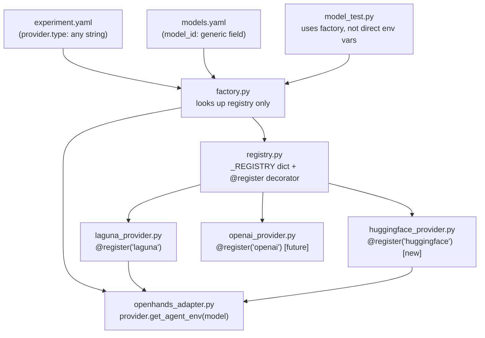
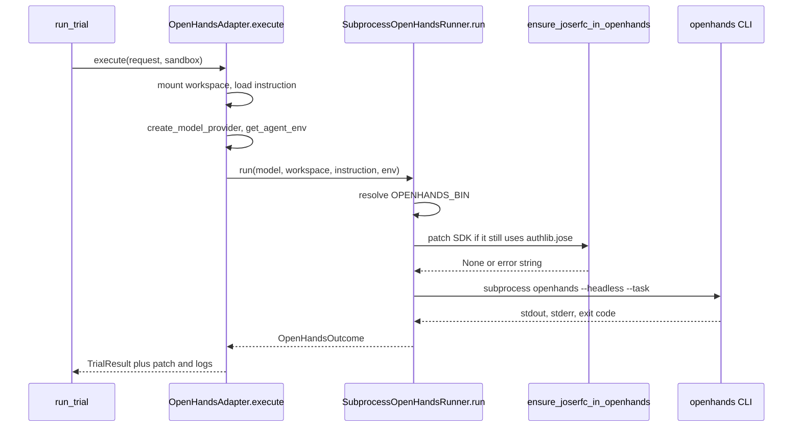

# Provider-agnostic architecture

Model providers are plugins. Switching Laguna, HuggingFace, or another backend should not require rewriting the agent, factory, or smoke test. New providers self-register; YAML chooses which one runs.

## Flow

## How it fits together

1. `experiment.yaml` sets `provider.type` as a string (`laguna`, `huggingface`, …).
2. `models.yaml` lists models with a generic `model_id` (not a provider-named field).
3. `create_model_provider()` looks up that type in `_REGISTRY` and calls `from_config()`.
4. Each provider class is decorated with `@register("...")` and implements:
   - `from_config` — read env + YAML into an instance
   - `get_agent_env` — env vars OpenHands needs (`LLM_BASE_URL`, `LLM_API_KEY`, proxy, …)
   - `generate` — smoke-test / direct completion
5. `OpenHandsAdapter._llm_runtime()` never hardcodes Laguna; it asks the provider for env vars.
6. `model_test.py` uses the same factory, so changing YAML is enough to hit a different backend.

## OpenHands trial run

One trial is: experiment → adapter → runner → (JWT library fix) → CLI.

1. `OpenHandsAdapter.execute` mounts the sandbox, reads `task.toml` and `instruction.md`, snapshots files, then asks the model provider for env vars (`LLM_BASE_URL`, `LLM_API_KEY`, proxy).
2. `SubprocessOpenHandsRunner.run` finds the `openhands` binary.
3. Before launch, `ensure_joserfc_in_openhands` installs `joserfc` with `uv pip --python` (the uv-tool Python has no `pip` module), then rewrites SDK 1.21 JWT code from `authlib.jose` to `joserfc` if needed.
4. The runner starts `openhands --headless --json --override-with-envs --task <instruction>` in the workspace.
5. The adapter diffs the workspace, maps events to a trajectory, and returns `success` / `error` / `timeout`. Scoring happens later in `run_trial`.

## Adding pieces without rewriting the core

| Goal | What you add | Prompt file |
|------|----------------|-------------|
| New model provider | New `*_provider.py` + one import in `_load_providers()` | [add_provider.txt](add_provider.txt) |
| New benchmark task | New `datasets/internal-core/<task>/` + YAML task id | [add_task.txt](add_task.txt) |
| New prompt variant | One-time `prompt_template` on `TaskSpec`, then YAML-only variants | [add_prompt.txt](add_prompt.txt) |
